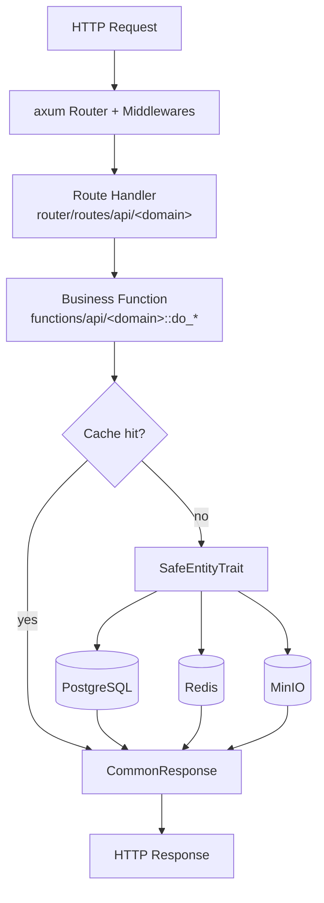

# 架构概览

> [← 返回索引](../README.md) · 构建请见 [构建指南](./building.md)

本项目是一个 `axum` + `sea-orm` 的单体后端，按四个 Cargo 包自底向上分层。依赖
方向严格单向：`router → functions → database → utils`，任何反向引用都会在编译
期被发现。

## 四包分层

| 包 | 职责 | 关键内容 |
|---|---|---|
| `utils` | 通用基础 | DTO/VO 类型（`src/types/`、`src/models/`）、`SafeEntityTrait` 宏、JWT、`CommonResponse` 包装 |
| `database` | 数据访问 | sea-orm 实体，按域组织于 `src/models/<domain>/`，全局 `DB_CONN` 连接池 |
| `functions` | 业务逻辑 | `src/functions/api/<domain>.rs` 提供 `do_*` 异步函数，编排实体读写与缓存 |
| `router` | 接入层 | axum 路由 `src/routes/api/<domain>/`、中间件（鉴权、日志、限流）、二进制 `_router` |

## 请求流

```
HTTP 请求
  │
  ▼
axum Router（tower 中间件链：tracing / CORS / ExtractAuthInfo）
  │
  ▼
路由处理函数  packages/router/src/routes/api/<domain>/<op>.rs
  │   提取 ExtractAuthInfo + Json/Path
  ▼
业务函数      packages/functions/src/functions/api/<domain>.rs :: do_*
  │   编排校验、缓存查询、实体读写
  ▼
SafeEntityTrait  packages/utils/src/db_operations.rs
  │   find_safety / update_safety / delete_safety（软删除 + 乐观锁）
  ▼
sea-orm ─► PostgreSQL      redis（缓存）      minio（对象存储）
```

对应的 mermaid 图：



## SafeEntityTrait 模式

所有内容域实体通过 `impl_safe_operation!` 宏（`packages/utils/src/db_operations.rs`）
获得三个安全操作：`find_safety`（过滤 `del_flag=false`）、`update_safety`（带
`version` 乐观锁，`WHERE version = last_version` 并自增）、`delete_safety`（置
`del_flag=true` 软删除）。宏还把 `ActiveModelBehavior::before_delete` 改为直接
报错，从而在编译期之外、运行期禁止硬删除。这套模式是 Rust 侧对 Java 侧
`BaseEntity` + MyBatis-Plus 逻辑删除/乐观锁的对齐实现。

## Redis 与 MinIO 集成点

- **Redis**：`packages/functions/src/functions/api/cache.rs` 暴露按域的缓存刷新端点
  （area、item、marker、icon_tag、notice 等），`router/src/routes/api/cache/`
  对应路由。热点列表查询优先读缓存、未命中回源并回填。
- **MinIO**：`router/src/routes/api/res/upload.rs` 处理资源上传；`item_doc` /
  `marker_doc` 的 `list_page_bin` / `list_page_md5` 端点用于归档导出（对应 Java
  侧 BinaryMD5 压缩归档）。
